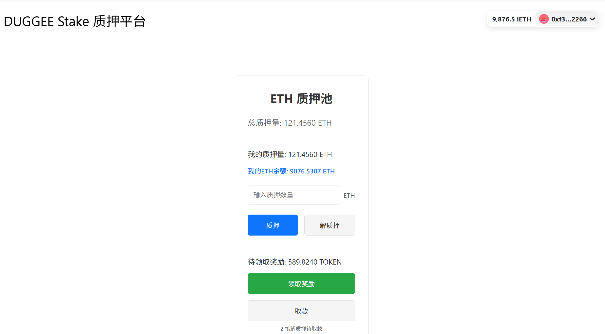
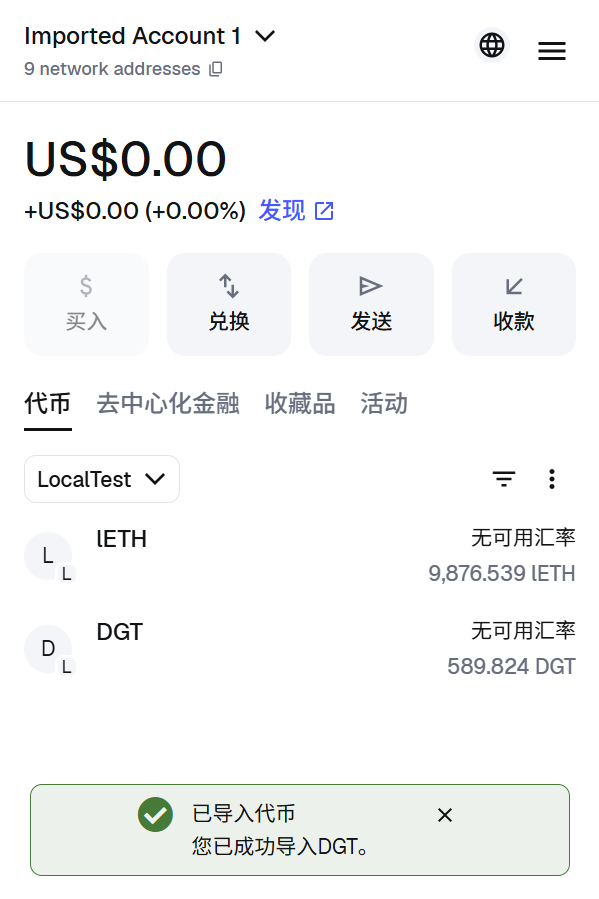

# DuggeeStake - 多代币质押挖矿 DApp

[](https://solidity.readthedocs.io/)
[](https://book.getfoundry.sh/)
[](https://opensource.org/licenses/MIT)

一个完整的多代币质押挖矿去中心化应用，支持多种代币池质押、奖励分配和灵活的质押管理。

## 📋 项目概述

DuggeeStake 是一个基于以太坊的去中心化质押挖矿平台，用户可以质押多种类型的代币来获得奖励代币。项目采用模块化架构，包含智能合约和前端界面两大部分。

## 图示





### 🏗️ 项目结构

```
metanode-advanced2-stake/
├── stake-contract/          # 智能合约目录
│   ├── src/
│   │   ├── DuggeeStake.sol  # 主质押合约
│   │   ├── DuggeeToken.sol  # 代币合约
│   │   └── MyTimelockController.sol # 时间锁合约
│   ├── script/              # 部署脚本
│   ├── test/                # 测试文件
│   ├── lib/                 # 依赖库
│   └── foundry.toml         # Foundry 配置
├── stake-fe/                # 前端应用目录
│   ├── src/                 # 源代码
│   ├── public/              # 静态资源
│   ├── package.json         # 依赖配置
│   └── README.md            # 前端文档
├── img/                     # 项目图片
├── README.md                # 项目说明文档
└── TODO.md                  # 开发任务清单
```

## ⭐ 核心特性

### 🎯 多代币池支持
- **灵活的池管理**: 支持创建多个独立的质押池，每个池可配置不同的代币
- **权重分配系统**: 每个池可设置独立的权重，用于分配总奖励
- **自定义参数**: 每个池支持设置最小质押数量等个性化参数

### 💎 智能质押机制
- **ETH & ERC20 支持**: 同时支持原生 ETH 和各种 ERC20 代币质押
- **实时奖励计算**: 基于区块数量的实时奖励累积机制
- **防重入攻击**: 集成 ReentrancyGuard 保护用户资金安全

### 🔒 安全设计
- **可升级合约**: 基于 UUPS 代理模式，支持合约升级
- **访问控制**: 基于 OpenZeppelin 的角色权限管理
- **紧急暂停**: 支持在异常情况下暂停各项操作
- **时间锁机制**: 重要操作需要时间锁延迟执行

### 🎛️ 管理功能
- **动态暂停控制**: 可独立控制质押、提取、领取奖励功能
- **奖励参数调整**: 支持调整每区块奖励数量和锁定期
- **池权限管理**: 管理员可创建和管理质押池

## 🚀 功能模块

### 1. 智能合约功能

#### DuggeeStake 合约
- **池管理**: 创建、配置和管理多个质押池
- **质押操作**: 支持多种代币的质押和解除质押
- **奖励计算**: 实时计算和分配质押奖励
- **资金管理**: 安全的资金转移和提取机制

#### DuggeeToken 合约
- **标准 ERC20**: 完全兼容 ERC20 标准
- **铸造功能**: 支持铸造新的代币用于奖励

#### MyTimelockController 合约
- **时间锁控制**: 重要操作需要延迟执行
- **多重签名**: 支持多签名验证提高安全性

### 2. 前端界面功能

#### 用户操作界面
- **钱包连接**: 支持 MetaMask 等主流钱包
- **质押信息查询**: 实时显示用户质押数据和奖励
- **池信息展示**: 展示各池的统计数据和权重信息

#### 交易功能
- **质押操作**: 一键质押多种代币
- **解除质押**: 灵活的解除质押和锁定机制
- **奖励领取**: 便捷的奖励领取和提取
- **资金提取**: 解锁后的本金提取

## 🛠️ 技术栈

### 后端技术
- **Solidity ^0.8.13**: 智能合约开发语言
- **Foundry**: 以太坊开发框架
- **OpenZeppelin**: 安全的合约库
- **Hardhat**: 兼容的开发环境

### 前端技术
- **React**: 现代化前端框架
- **TypeScript**: 类型安全的 JavaScript
- **Next.js**: 全栈 React 框架
- **Web3.js**: 以太坊交互库
- **Ethers.js**: 以太坊 JavaScript 库

### 开发工具
- **Git**: 版本控制系统
- **Node.js**: JavaScript 运行时
- **npm/yarn**: 包管理器
- **VS Code**: 推荐的开发环境

## 📖 快速开始

### 环境要求
- Node.js >= 16.0.0
- Git
- MetaMask 或兼容的钱包

### 安装步骤

1. **克隆项目**
   ```bash
   git clone https://github.com/your-repo/metanode-advanced2-stake.git
   cd metanode-advanced2-stake
   ```

2. **安装合约依赖**
   ```bash
   cd stake-contract
   foundry install
   ```

3. **安装前端依赖**
   ```bash
   cd ../stake-fe
   npm install
   ```

4. **编译合约**
   ```bash
   cd ../stake-contract
   forge build
   ```

5. **运行测试**
   ```bash
   forge test
   ```

6. **部署合约**
   ```bash
   forge script script/Deploy.s.sol --rpc-url <your-rpc-url> --private-key <your-private-key>
   ```

7. **启动前端**
   ```bash
   cd ../stake-fe
   npm run dev
   ```

### 配置说明

1. **网络配置**
   - 在 `stake-fe/src/config/networks.ts` 中配置网络信息
   - 设置 RPC URL 和链 ID

2. **合约地址**
   - 在部署后更新合约地址配置
   - 确保地址与网络匹配

3. **环境变量**
   - 复制 `.env.example` 到 `.env`
   - 配置必要的环境变量

## 🔧 使用指南

### 用户使用流程

1. **连接钱包**
   - 点击"连接钱包"按钮
   - 授权钱包连接

2. **查看质押信息**
   - 选择代币池
   - 查看当前 APR 和池统计

3. **质押代币**
   - 输入质押数量
   - 确认交易
   - 等待区块确认

4. **管理质押**
   - 发起解除质押
   - 等待锁定期结束
   - 提取本金

5. **领取奖励**
   - 查看可领取奖励
   - 一键领取奖励

### 管理员操作

1. **创建新池**
   - 调用 `createPool()` 函数
   - 设置代币地址和权重
   - 配置最小质押数量

2. **参数调整**
   - 修改奖励参数
   - 调整锁定时间
   - 更新池权重

3. **安全管理**
   - 紧急暂停功能
   - 合约升级操作
   - 时间锁管理

## 🧪 测试

### 运行测试套件

```bash
# 运行所有测试
forge test

# 运行特定测试
forge test --match-test testName

# 显示详细输出
forge test -vvv

# 生成测试覆盖率报告
forge coverage
```

### 测试覆盖范围
- ✅ 质押和解除质押功能
- ✅ 奖励计算和领取
- ✅ 权限控制和安全性
- ✅ 紧急暂停机制
- ✅ 合约升级流程

## 📊 API 文档

### 主要合约接口

#### DuggeeStake

```solidity
// 创建质押池
function createPool(
    address _tokenAddress,
    uint256 _weight,
    uint256 _minStakeAmount,
    bool _withupdate
) external;

// 质押代币
function stake(
    address tokenAddress,
    uint256 amount
) public payable;

// 解除质押
function unstake(
    address tokenAddress,
    uint256 _amount
) public;

// 领取奖励
function claim(address tokenAddress) public;

// 提取本金
function withdraw(address tokenAddress) external;

// 获取池信息
function getPool(uint256 pid) public view returns (Pool memory);

// 获取质押者信息
function getStaker(address tokenAddress, address staker)
    public view returns (Staker memory);
```

## 🛡️ 安全性

### 安全特性
- **重入攻击保护**: 使用 ReentrancyGuard
- **权限控制**: 基于 OpenZeppelin AccessControl
- **暂停机制**: 支持紧急情况下的操作暂停
- **合约升级**: UUPS 代理模式支持安全升级
- **时间锁**: 重要操作需要延迟执行

### 审计建议
- 建议进行专业安全审计
- 使用自动化安全检测工具
- 定期检查依赖库的安全更新

## 🤝 贡献指南

我们欢迎社区贡献！请遵循以下步骤：

1. Fork 项目
2. 创建特性分支 (`git checkout -b feature/AmazingFeature`)
3. 提交更改 (`git commit -m 'Add some AmazingFeature'`)
4. 推送到分支 (`git push origin feature/AmazingFeature`)
5. 开启 Pull Request

### 代码规范
- 遵循 Solidity 最佳实践
- 使用 TypeScript 进行前端开发
- 编写完整的测试用例
- 添加必要的代码注释

## 📝 许可证

本项目基于 MIT 许可证开源。详情请参阅 [LICENSE](LICENSE) 文件。

## 🙏 致谢

- [OpenZeppelin](https://openzeppelin.com/) - 安全的智能合约库
- [Foundry](https://book.getfoundry.sh/) - 优秀的开发框架
- [React](https://reactjs.org/) - 强大的前端框架
- [Web3.js](https://web3js.readthedocs.io/) - 以太坊交互库

---

**⚠️ 免责声明**: 本项目仅供学习和研究使用。在生产环境使用前，请进行全面的安全审计。
